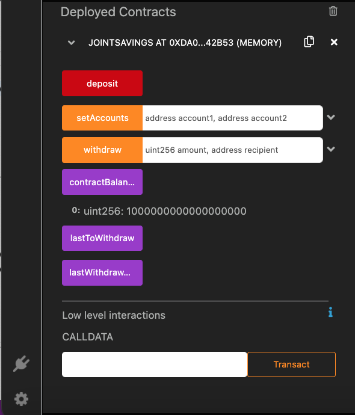
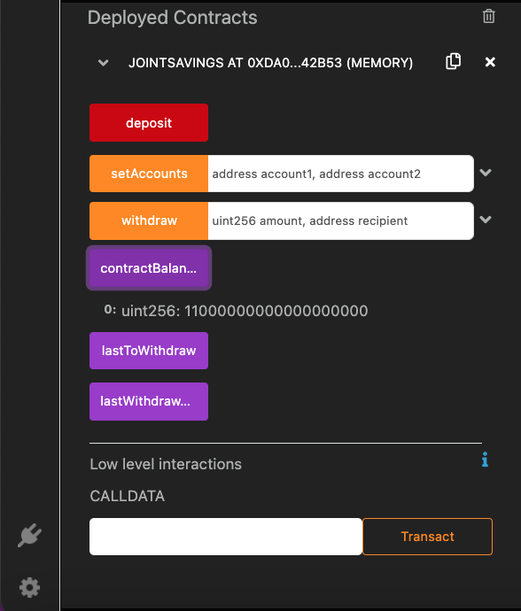
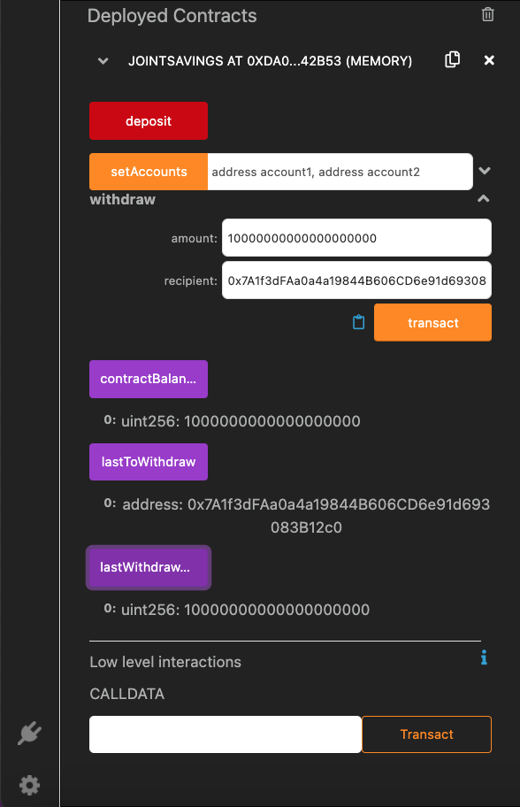

# Joint Savings Contract

The goal of this project was to create a contract that can send **ETH** to either one of two savings accounts. This contract will have a withdraw function that requires that the **recipient** of the funds in the smart contract are your two savings accounts. Otherwise, funds will not be withdrawn. There is a **deposit** function and also a **fallback** function that can be used to deposit funds into the contract. There is a function to set accounts `setAccounts` that will take in two payable address `account1` and `account2` that receive savings from the smart contract. 

## Testing Contract Functionality

- [x] Using deposit function to deposit funds

- [x] Withdrawing funds to accountOne and accountTwo

### Improvements 

I would add a modifier `onlyOwner` to the contract that would require `msg.sender` owner when the deployed contract to be ther owner. Then I would add the modifier to `setAccounts` funtion.